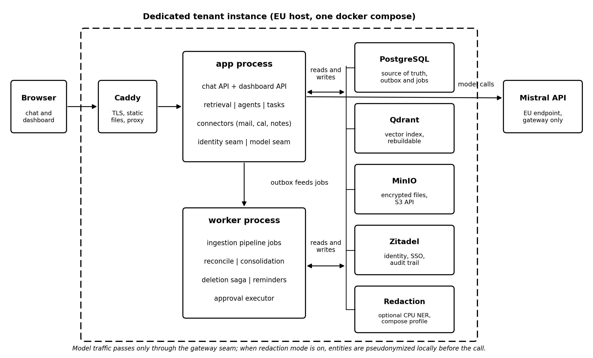
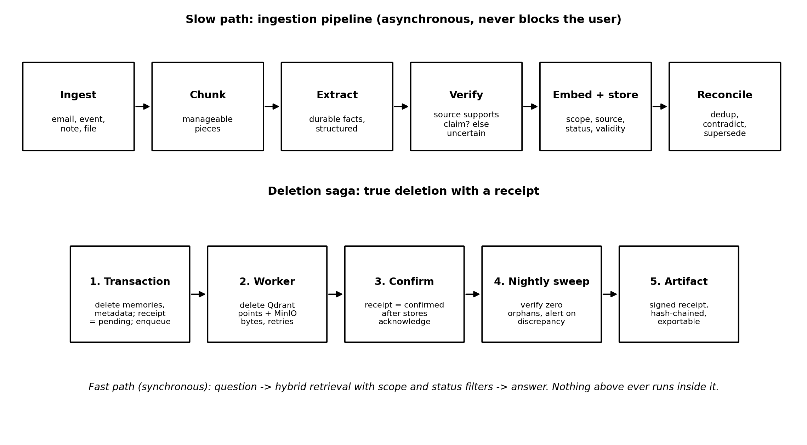

# Cogeto — Technical Architecture and Implementation Plan

*Markdown companion to `Cogeto-Technical-Architecture.docx` (same content, agent-greppable). The docx is the presentation copy; this file is the working copy. If they ever diverge, this file wins and the docx is regenerated.*

*Binding companions: v1 Specification, v1 Scope, Verifiable Memory Addendum, decisions 0001 and 0002.*

## 1. Introduction and How to Read This Document

This document translates the Cogeto product specification and the
Verifiable Memory Addendum into a concrete engineering plan: which
technologies are used and why, how the runtime is composed, how the
critical mechanisms work, which libraries are selected, in what order
the system is built, and how the team (human and AI agents alike) works
day to day. Where this document names a specific library or version
approach, it is a committed default: change requires a decision record,
not a silent substitution.

Three principles govern every choice below. **First, production posture
from the first commit:** idempotent jobs, transactional ingestion,
verified deletion, and enforced module boundaries are built now, because
they are rewrites later. **Second, the smallest honest footprint:** each
customer runs a dedicated instance, so every container and every
megabyte is multiplied across the fleet and priced into margin. **Third,
boring technology, novel product:** differentiation lives in verifiable
memory (receipts, history, published accuracy), not in exotic
infrastructure. The stack is chosen to be mature, well documented, and
unsurprising.

## 2. Architecture Overview

Cogeto is a **modular monolith**: one codebase, strict internal module
boundaries, and exactly two deployable application processes per tenant.
The **app process** serves the chat API, the dashboard API, the
connectors, and the approval endpoints. The **worker process** runs
everything asynchronous: the ingestion pipeline, reconciliation and
consolidation, the deletion saga, reminders, and the execution of
approved actions. Both are built from the same image; only the
entrypoint differs. This is the architecture that keeps a
dedicated-instance business profitable: the per-tenant footprint stays
at six or seven containers instead of fifteen.

*Figure 1. Per-tenant runtime topology. One compose file, two
application processes, four infrastructure services, one optional
redaction profile, one external EU model endpoint.*

### 2.1 The two hard separations

- **Fast path versus slow path.** Answering the user is synchronous and
  touches only retrieval. Extraction, verification, deduplication,
  contradiction detection, consolidation, and deletion run as background
  jobs after the response is delivered. Nothing heavy ever executes
  inside a request handler; this is enforced in code review and by the
  module dependency rules, not by convention.

- **Source of truth versus index.** PostgreSQL owns all facts: memories,
  statuses, scopes, provenance, validity intervals, tasks, receipts, and
  the job queue itself. Qdrant holds vectors plus a payload copy of the
  filterable fields and is rebuildable at any time with a single reindex
  command. Losing Qdrant loses nothing; it is rebuilt from Postgres.
  This asymmetry is what makes true deletion provable and disaster
  recovery trivial.

### 2.2 Bounded contexts (modules)

The codebase is organized as domain-driven bounded contexts. Each module
exposes exactly one public interface; internals, including tables, are
private to the module. Cross-module communication happens through domain
events on the Postgres outbox, the same mechanism that feeds the job
queue. These rules are enforced mechanically in CI (dependency linting),
because unenforced modularity erodes within months.

| **Module**           | **Owns**                                                                                    | **Key invariants it guards**                                                                                                  |
|----------------------|---------------------------------------------------------------------------------------------|-------------------------------------------------------------------------------------------------------------------------------|
| memory               | Memory aggregate, statuses, scopes, provenance, validity intervals, deletion saga, receipts | Seven-state status machine; only reconciliation sets contradicted; only the user sets user-approved; provenance is never null |
| ingestion            | Ingest, chunk, extract, verify, embed, store pipeline                                       | Facts, never raw documents, enter the vector store; every fact passes independent verification before becoming active         |
| retrieval            | Hybrid search, fusion, ranking                                                              | Scope and sensitive are hard filters inside the query; statuses are score multipliers; no app-side post-filtering             |
| agents               | Drafting, proposals, approval state machine                                                 | Consequential actions execute only from a server-side approved state, only in the worker                                      |
| connectors           | Notes capture and email inbound (via receive-only Haraka forwarding — no OAuth/CASA; calendar dropped from v1)                                            | Ingestion via outbox only; email accepted by the per-tenant Haraka container and dropped onto the pipeline                                                         |
| tasks                | Todos, open loops, reminders, digests, dreaming card                                        | Derived from memory; never mutates memory directly                                                                            |
| identity (seam)      | Authenticated principal, org, roles; wraps Zitadel                                          | No other module calls Zitadel; scope filtering is Cogeto logic, not identity-provider logic                                   |
| model-gateway (seam) | All model and embedding calls; prompt registry                                              | No other module calls a model API; prompts are versioned artifacts with eval scores                                           |

## 3. Technology Stack and Rationale

| **Layer**            | **Technology**                                | **Why this and not the alternative**                                                                                                                                                                               |
|----------------------|-----------------------------------------------|--------------------------------------------------------------------------------------------------------------------------------------------------------------------------------------------------------------------|
| Language             | TypeScript (Node.js 22 LTS)                   | One language across API, worker, and frontend; a single toolchain, shared types end to end, and the widest agent-assisted-coding support. Go was the runner-up; TS wins on full-stack unification for a small team |
| Backend framework    | NestJS 11                                     | First-class module system that maps one-to-one onto DDD bounded contexts; dependency injection makes the identity and model seams natural interfaces; mature ecosystem                                             |
| Frontend             | React 19 + Vite, TanStack Query, Tailwind CSS | SPA built to static files and served by Caddy; no server-side rendering needed for an authenticated tool; smallest operational surface                                                                             |
| Database             | PostgreSQL 17                                 | Source of truth for everything including the job queue and outbox; one backup captures the entire system state                                                                                                     |
| DB access            | Drizzle ORM + drizzle-kit migrations          | SQL-first and type-safe without a query-engine black box; migrations are plain, reviewable SQL, which matters when schema decisions are contractual (scope, provenance, statuses)                                  |
| Job queue            | Graphile Worker                               | Runs on Postgres itself: transactional enqueue in the same commit as the ingested event, no Redis, one fewer container per tenant, exactly the outbox semantics the architecture requires                          |
| Vector store         | Qdrant                                        | Production-grade filtered HNSW; payload indexes on owner, scope, and status make pre-filtering native; pluggable behind the memory module                                                                          |
| Object storage       | MinIO (S3 API)                                | EU-controlled encrypted file storage; the S3 client code also targets Scaleway, OVHcloud, or Hetzner object storage per deployment without change                                                                  |
| Identity             | Zitadel                                       | Registration, login, SSO, organizations, roles, tamper-evident audit trail; AGPL like the core; wrapped by the identity seam                                                                                       |
| Model                | Mistral API (EU)                              | Only model in v1, called exclusively through the gateway seam; DPA and EU processing stated on the privacy page                                                                                                    |
| Edge                 | Caddy 2                                       | Automatic TLS, static file serving for the SPA, reverse proxy to app and Zitadel; one small container replaces three concerns                                                                                      |
| Redaction (optional) | Presidio-based NER service (Python, CPU)      | Local entity detection and pseudonymization before external model calls; isolated as its own small container behind a compose profile precisely because it is Python in a TypeScript stack                         |
| Validation           | Zod                                           | Runtime validation at every boundary: API input, connector payloads, model outputs, job payloads                                                                                                                   |
| Packaging            | Docker + docker compose                       | One command brings up a complete instance; profiles switch demo seeding and redaction on and off                                                                                                                   |

### 3.1 Choices worth defending in one paragraph each

**Why a Postgres job queue instead of Redis or RabbitMQ.** The single
most important correctness property in Cogeto is that nothing can be
ingested and silently unprocessed. Graphile Worker jobs are enqueued
inside the same database transaction that records the source event,
which makes that guarantee structural rather than aspirational. It also
removes an entire stateful service from every tenant, and at Cogeto's
per-tenant volumes (thousands of jobs per day, not millions per second)
Postgres queueing is far below its performance ceiling.

**Why Drizzle instead of Prisma.** Cogeto's schema is contractual: scope
on every row, provenance never null, seven-state status enums, validity
intervals. Migrations must be reviewable SQL that an audit can read, and
queries must be inspectable for the one bug class that is unacceptable
(a memory read without a scope filter). Drizzle keeps the SQL visible
and the types strict; nothing is generated behind a proprietary engine.

**Why the frontend is a static SPA.** The product is an authenticated
tool, not a public content site, so server-side rendering buys nothing.
Building to static files served by Caddy means the frontend adds zero
runtime processes per tenant, and the app process remains a pure API.

**Why the redaction service is a separate container.** The best local
NER tooling is Python. Rather than polluting the TypeScript monolith,
redaction is a tiny internal HTTP service with one endpoint (detect and
pseudonymize), enabled by a compose profile only for tenants who switch
redaction mode on. It holds no state and needs roughly one gigabyte of
memory on CPU.

## 4. Runtime Topology and Containers

One tenant equals one compose project. Every service carries a
healthcheck, and startup ordering uses health conditions, not sleep
timers. Migrations run as a one-shot init container before the app
starts; MinIO bucket creation and Zitadel bootstrap (first organization,
first admin, OIDC application) are also one-shot init jobs, so a fresh
instance reaches a usable login with a single command and zero clicks.

| **Container**        | **Image basis**                      | **Purpose**                                      | **Indicative RAM** |
|----------------------|--------------------------------------|--------------------------------------------------|--------------------|
| caddy                | caddy:2                              | TLS termination, SPA static files, reverse proxy | 30 to 60 MB        |
| app                  | Cogeto image, node entrypoint app    | API: chat, dashboard, connectors, approvals      | 250 to 400 MB      |
| worker               | Cogeto image, node entrypoint worker | All background jobs via Graphile Worker          | 250 to 400 MB      |
| postgres             | postgres:17                          | Source of truth, outbox, job queue               | 300 to 600 MB      |
| qdrant               | qdrant/qdrant                        | Vector index with payload filtering              | 200 to 500 MB      |
| minio                | minio/minio                          | Encrypted object storage, S3 API                 | 150 to 300 MB      |
| zitadel              | zitadel/zitadel                      | Identity, SSO, audit trail (shares Postgres)     | 100 to 200 MB      |
| redaction (profile)  | Cogeto NER image (Python, CPU)       | Local PII detection and pseudonymization         | 700 MB to 1 GB     |
| init jobs (one-shot) | Cogeto image / mc / zitadel setup    | Migrations, bucket creation, identity bootstrap  | transient          |

**Fleet math:** a baseline tenant without redaction fits comfortably in
2 GB of RAM and one shared vCPU, which maps to the smallest instances at
European providers and preserves the target margin at the planned
per-instance pricing. Compose profiles: **demo** seeds the Ana sandbox
persona; **redaction** adds the NER service. Self-hosters run exactly
the same file, which is the transparency promise kept literally.

## 5. Data Architecture

### 5.1 PostgreSQL: the contractual core (migration 0001)

> memory(id, owner_id NOT NULL, scope enum(private, shared) NOT NULL,
>
> source_type NOT NULL, source_id NOT NULL, -- provenance, never null
>
> status enum(active, outdated, contradicted, uncertain,
>
> replaced, user_approved, sensitive) NOT NULL DEFAULT active,
>
> valid_from, valid_until, -- time-travel intervals
>
> content, embedding_ref, created_at, updated_at)
>
> file_metadata(object_key, owner_id, scope, sensitive, upload_date,
> checksum)
>
> deletion_receipt(id, source_ref, counts_json, status enum(pending,
> confirmed),
>
> prev_hash, hash, signed_at) -- hash-chained, tamper evident
>
> approval(id, action_type, payload, status enum(draft,
> pending_approval,
>
> approved, rejected, expired, executed), decided_by, decided_at)

Supporting tables: users and org mapping (thin, identity lives in
Zitadel), tasks and reminders, connector accounts with encrypted tokens,
prompt registry (version, text hash, eval score), golden-set records for
the evaluation harness, and the Graphile Worker job tables. Status
transitions are enforced in the memory aggregate, not scattered across
services: the set of legal transitions is a single reviewed function.

### 5.2 Qdrant: one collection, strict payload

A single collection holds memory vectors. Each point carries the payload
fields owner_id, scope, status, source_type, source_id, and valid_until,
with payload indexes on the first three. Every search request includes
the scope filter and the sensitive gate as native Qdrant filter clauses;
the application never fetches broadly and filters afterwards. The
reindex command streams all memories from Postgres, re-embeds if the
embedding model version changed, and rebuilds the collection; it is
exercised in CI so it can never rot.

### 5.3 MinIO: scoped keys, signed access

> {org_id}/{user_id}/{scope}/file-{uuid}

The first key segment is the Zitadel organization id, keeping keys
stable if small tenants are ever consolidated. Server-side encryption is
on; user downloads use short-lived signed URLs; the sensitive flag gates
who may generate a URL at all. An optional extract-and-discard mode (a
per-upload flag with a per-user default) keeps derived memories and
deletes the original bytes immediately after the pipeline confirms
extraction.

## 6. Key Mechanisms

*Figure 2. The slow-path ingestion pipeline and the deletion saga. Both
run entirely in the worker; the fast path only ever performs filtered
retrieval.*

### 6.1 Outbox and jobs

Every state change that must trigger downstream work (a new email
ingested, a document uploaded, a deletion requested, an action approved)
writes a domain event and its job in the same Postgres transaction as
the change itself. Workers claim jobs with row locking, execute
idempotently under the key (source_type, source_id, job_type), retry
with exponential backoff, and park permanent failures in a dead-letter
state visible in the dashboard. A crashed worker loses nothing; a
duplicate delivery changes nothing.

### 6.2 Retrieval: hybrid, fused, filtered

A user question fans out to three signals: semantic vector search in
Qdrant, full-text search in Postgres, and trigram matching on entity
names (people, projects). Results are fused with reciprocal rank fusion,
then status multipliers are applied. Scope and the sensitive flag are
hard filters inside each underlying query and are never expressible as
score penalties, because a demoted leak is still a leak.

| **Status**             | **Multiplier** | **Behavior**                                                  |
|------------------------|----------------|---------------------------------------------------------------|
| active / user_approved | 1.0            | Full weight                                                   |
| uncertain              | 0.6            | Retrievable, visibly marked as unconfirmed                    |
| contradicted           | 0.4            | Retrievable with an explicit warning and both sources shown   |
| outdated               | 0.2            | Strongly demoted; surfaced by temporal queries                |
| replaced               | 0.0            | Excluded by default; visible in history and time-travel views |

### 6.3 Self-verifying extraction

Extraction produces candidate facts; a second, independent model pass
receives each fact plus its source excerpt and answers supported,
partial, or unsupported. Only supported facts become active; everything
else is stored as uncertain and queued for user review. The verifier
uses a different prompt than the extractor, and both prompts are
versioned artifacts whose accuracy against the golden set is recorded in
the prompt registry. This mechanism is what makes the seven statuses
earned rather than decorative, and its outcomes feed the published trust
score.

### 6.4 Deletion saga and receipts

Deletion follows the five steps in Figure 2: a single Postgres
transaction removes memories and metadata, writes a pending receipt, and
enqueues the external deletions; the worker removes Qdrant points and
MinIO bytes with retries; the receipt flips to confirmed only after both
stores acknowledge; a nightly sweep proves the absence of orphans; and
the resulting receipt is signed, hash-chained to its predecessor, and
exportable. The full cascade is covered by an automated test that is
part of the definition of done for the memory module.

### 6.5 Approval state machine

Consequential actions (sending a message, bulk memory changes, external
writes) are rows, not intentions: draft, pending_approval, approved,
rejected, expired, executed. The confirm endpoint is authenticated and
audited; execution happens only in the worker and only from the approved
state. A front-end confirmation dialog is a courtesy, never the control.

### 6.6 Evaluation harness

A golden set of 50 to 100 hand-labeled notes, emails, and events (per
supported language) defines expected memories. CI runs extraction,
verification, deduplication, and contradiction detection against it on
every change to prompts, models, or pipeline code, and fails the build
below thresholds. The same numbers, published per release, are the
public trust score. The harness is built alongside the extractor in the
first implementation phase, not retrofitted, because extraction quality
is the product.

## 7. Library Selection

| **Library**                                      | **Role**                                 | **Note**                                                                       |
|--------------------------------------------------|------------------------------------------|--------------------------------------------------------------------------------|
| @nestjs/core and friends                         | Application framework, DI, module system | Modules map to bounded contexts; seams are injected interfaces                 |
| drizzle-orm, drizzle-kit, pg                     | Typed SQL and migrations                 | Migrations are reviewable SQL files, numbered from 0001                        |
| graphile-worker                                  | Postgres job queue                       | Transactional enqueue; cron-style scheduling for digests and the nightly sweep |
| @qdrant/js-client-rest                           | Vector store client                      | Wrapped entirely inside the memory module                                      |
| @aws-sdk/client-s3, s3-request-presigner         | Object storage via S3 API                | Targets MinIO and EU S3 clouds identically                                     |
| openid-client                                    | OIDC against Zitadel                     | Used only inside the identity seam                                             |
| @mistralai/mistralai                             | Model API client                         | Used only inside the model gateway; embeddings included                        |
| zod                                              | Boundary validation                      | API DTOs, connector payloads, job payloads, and model output parsing           |
| pino                                             | Structured logging                       | Redaction rules forbid memory content and tokens in logs                       |
| react, vite, @tanstack/react-query, tailwindcss  | Dashboard and chat frontend              | Static build served by Caddy                                                   |
| vitest, supertest, @testcontainers/postgresql    | Unit and integration testing             | Integration tests run against real Postgres, Qdrant, and MinIO containers      |
| playwright                                       | End-to-end tests                         | Login through Zitadel, chat round trip, deletion receipt flow                  |
| dependency-cruiser, eslint, prettier             | Boundary enforcement and hygiene         | CI fails on any cross-module import that violates the context map              |
| presidio-analyzer / presidio-anonymizer (Python) | Redaction service                        | Isolated container; single internal endpoint                                   |

Rule for additions: any new dependency requires a one-paragraph decision
record naming the alternative considered and the reason. Dependency
sprawl is a fleet-maintenance cost multiplied by every tenant instance.

## 8. Implementation Plan

> **Phases 5–8 below are superseded by [`docs/Cogeto-v1-Roadmap-Revision.md`](Cogeto-v1-Roadmap-Revision.md) (BINDING).** Calendar is dropped from v1 (reconsidered only post-2.0). Email arrives by forwarding into a per-tenant, receive-only **Haraka** SMTP container — no OAuth, no CASA, no Gmail scope assessment, no sending. Operations are script-driven and manual-by-design (no Terraform/API automation/self-serve/monitoring/backup scripts). The trust-score page and compliance one-pager are **website deliverables**, not running-instance features. Local embeddings are deferred to 2.0. The rows are kept below for history; the revision's O4–O7 session ladder governs.

Phases are sequential and each ends in something demonstrable. The
connector order (notes first, email second — via receive-only Haraka
forwarding) is deliberate: it exercises the full pipeline with zero
OAuth friction and produces the public demo early. (Calendar, formerly
sequenced here, is dropped from v1 per the Roadmap Revision.)

| **Phase**                | **Scope**                                                                                                                                                                                   | **Exit criterion**                                                                 |
|--------------------------|---------------------------------------------------------------------------------------------------------------------------------------------------------------------------------------------|------------------------------------------------------------------------------------|
| 0\. Skeleton             | Repo structure per context map; compose with all services healthy; Zitadel bootstrap; CI with lint, type check, boundary check                                                              | docker compose up reaches a usable login on a fresh clone                          |
| 1\. Contractual core     | Migration 0001 (memory, file_metadata, receipts, approvals); outbox and Graphile Worker wiring; identity and model seams as interfaces with first implementations                           | Integration tests prove transactional enqueue and scope-filtered reads             |
| 2\. Notes vertical slice | Manual note capture; full pipeline ingest to reconcile; self-verifying extraction; embedding and Qdrant storage; hybrid retrieval; chat answer with sources; dashboard list, edit, statuses | A note becomes a correct, source-linked, verified memory answerable in chat        |
| 3\. Trust machinery      | Deletion saga with receipts and cascade test; approval state machine end to end; eval harness with golden set gating CI; prompt registry                                                    | Delete a document, receive a confirmed signed receipt; CI fails on eval regression |
| 4\. Ana sandbox          | Demo compose profile with seeded persona; public sandbox deployment; compliance one-pager                                                                                                   | A visitor asks what Ana promised Marko and watches a live deletion receipt         |
| 5\. Email via Haraka (O4)   | Per-tenant, receive-only Haraka SMTP container; unique per-instance inbound address; user forwards/BCCs/rules mail in; inbound parsing (incl. calendar-invite parts within emails) into the pipeline as source_type 'email'; thread-aware extraction; deletion saga covers email + receipts; reply drafts through approval, sent by the user from their own client | Email facts flow through the same pipeline with correct provenance; email never leaves the tenant's box |
| 6\. Time-travel + Passport (O5) | Per-entity/per-project time-travel diff UI (each change source-linked); Memory Passport one-click export (facts, statuses, provenance, validity history, receipts; documented versioned open format; export only)                                    | Knowledge changes are inspectable over time and the full memory is exportable      |
| 7\. Operator script + runbook (O6) | One script for a fresh OVHcloud Ubuntu instance (install/configure/upgrade/status): auto-does what it can (Docker, secrets, Haraka address, TLS, migrations), then prints a structured operator TODO (DNS incl. MX, OVH backup settings, verification). Runbook: onboarding, manual trials, OVH backup + rehearsed restore. No Terraform/API automation/monitoring | An operator onboards a fresh instance in under an hour from one script + its checklist |
| 8\. Launch gate (O7)       | Trust-score public page + compliance one-pager (**website deliverables** from curated cross-instance data, not instance features); OSS launch prep (CONTRIBUTING/CLA, SECURITY, README); re-run gap + security audits                          | Both audits pass; the OSS repo and website deliverables are launch-ready           |
| Later (2.0+)               | Calendar connector (if design-partner demand proves real); local embeddings and a local-LLM tier; operational automation (Terraform/self-serve/monitoring/backup scripts); Memory Passport import; dreaming digest chat card                    | Each ships as an independent increment on the same schema                          |

ISO 27001 / SOC 2 are handled by an external implementing company, not
built in-repo, and are kept out of the product roadmap.

## 9. Ways of Working

### 9.1 Repository and process conventions

- **Trunk-based development.** Short-lived branches, small reviewable
  pull requests, main always releasable. Feature flags are compose
  profiles or config, not long-lived branches.

- **Decision records.** Every notable choice (new dependency, schema
  change beyond additive, deviation from this document) gets a short
  numbered record in docs/decisions. The record names the alternative
  and the reason; ten lines is usually enough.

- **Agent-assisted engineering with guardrails.** AI coding agents work
  from CLAUDE.md and AGENTS.md, which encode the non-negotiables as a
  checklist. The research documents in docs/research are required
  reading before touching memory, retrieval, agents, or pipeline code.
  Agents propose; CI and the boundary rules dispose.

- **Definition of done.** Code, tests at the right level, migration if
  schema changed, decision record if a choice was made, docs updated,
  boundary check green, eval harness green when prompts or pipeline
  changed, and for the memory module specifically: the deletion cascade
  test passes.

### 9.2 Testing strategy

| **Level**   | **Tooling**             | **What it must cover**                                                                                                                                                            |
|-------------|-------------------------|-----------------------------------------------------------------------------------------------------------------------------------------------------------------------------------|
| Unit        | Vitest                  | Status transition function, fusion scoring, key derivations, validators                                                                                                           |
| Integration | Vitest + Testcontainers | Transactional enqueue, scope-filtered queries (including proving unscoped reads are impossible through the public interface), pipeline steps against real Postgres, Qdrant, MinIO |
| End to end  | Playwright              | Login via Zitadel, note to memory to chat answer, approval round trip, deletion receipt flow                                                                                      |
| Quality     | Eval harness in CI      | Extraction precision and recall, verification agreement, dedup and contradiction accuracy against the golden set                                                                  |

### 9.3 Prompts as engineering artifacts

Every prompt that decides what Cogeto remembers (extraction,
verification, deduplication, contradiction, consolidation) lives in the
repo, is numbered and immutable once released, carries a changelog
entry, and records its golden-set score in the prompt registry. Because
the core is open source, these prompts are public, which extends the
verifiable-memory posture into the model layer.

## 10. Security and Operations

- **Secrets:** environment variables injected per instance from the
  provisioning system; nothing secret in the repo or the image;
  connector OAuth tokens encrypted at the application layer before
  storage; log redaction enforced in the pino configuration.

- **Encryption at rest:** MinIO server-side encryption plus full-disk
  encryption on the host. Application-level envelope encryption is
  deliberately deferred; single-tenant isolation plus disk and object
  encryption answers the v1 threat model without gold-plating.

- **Backups:** nightly Postgres dumps and MinIO bucket sync to EU object
  storage in a second location; Qdrant is intentionally not backed up
  because reindex rebuilds it from Postgres; restore is rehearsed as
  part of Phase 7, not assumed.

- **Monitoring:** structured logs shipped per instance, uptime checks on
  Caddy and app health endpoints, job-queue depth and dead-letter
  alerts, and the nightly deletion sweep alerting on any orphan. Fleet
  dashboards aggregate per-tenant signals without aggregating tenant
  data.

- **Upgrades across the fleet:** one versioned image; instances upgrade
  by pulling the new tag and running pending migrations through the init
  container; canary on internal and demo instances first; rollback is
  the previous tag plus, when needed, reindex. The upgrade playbook is
  written and tested in Phase 7, because fleet operations is the second
  product.

## 11. Risks and Mitigations

| **Risk**                                 | **Mitigation**                                                                                                                                                                                         |
|------------------------------------------|--------------------------------------------------------------------------------------------------------------------------------------------------------------------------------------------------------|
| Extraction quality below trust threshold | Golden set and CI gates from Phase 2; self-verification demotes unsupported facts to uncertain instead of asserting them; published score keeps the team honest                                        |
| Email scope verification delays launch   | Decision forced before Phase 6; Microsoft and IMAP path exists regardless of the Gmail outcome                                                                                                         |
| Scope-filter regression leaks a memory   | Filters live inside queries and Qdrant payload filters; integration tests assert the public interface cannot express an unscoped read; dependency rules keep raw table access inside the memory module |
| Vector store and source of truth drift   | Qdrant is rebuildable by design; nightly sweep detects deletion orphans; reindex exercised in CI                                                                                                       |
| Per-tenant costs erode margin            | Two-process monolith, Postgres-based queue, no Redis, redaction only as an opt-in profile; footprint reviewed as a release metric                                                                      |
| Fleet operations overwhelm a small team  | Provisioning, teardown, backup, and upgrade automation are an explicit phase with exit criteria, not an afterthought                                                                                   |
| Dependency sprawl                        | Decision record required for every new library; the fleet multiplies every maintenance cost                                                                                                            |

**Closing note.** Nothing in this plan is speculative technology. Every
mechanism (outbox, saga, state machine, hybrid retrieval, evaluation
gates) is a well-understood pattern applied with discipline to one novel
end: memory whose trustworthiness can be inspected, corrected, and
proven. Build the contractual core first, keep the boundaries enforced,
and the rest of the roadmap is increments on a foundation that never
needs to be revisited.
